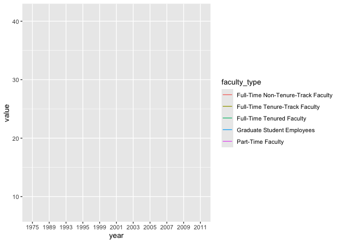
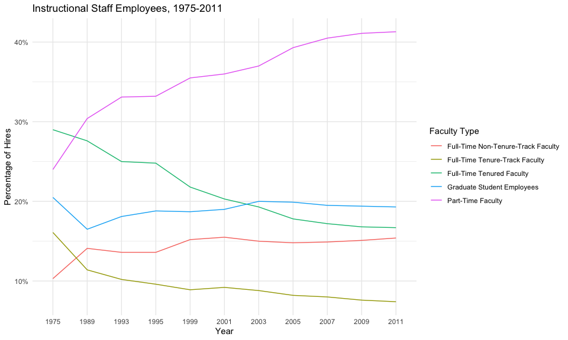
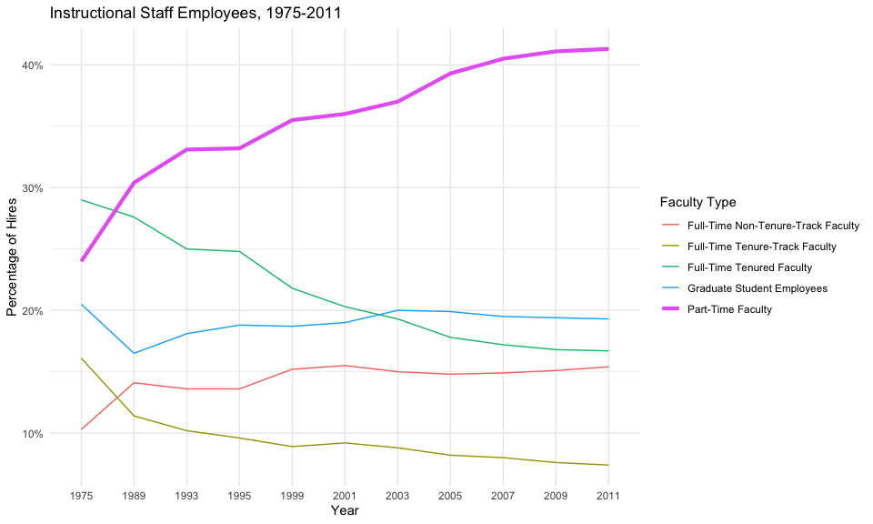

Lab 06 - Ugly charts and Simpson’s paradox
================
Noah Booker
3/28/25

### Load packages and data

``` r
library(tidyverse) 
library(scales)
#library(dsbox)
#library(mosaicData) 
```

``` r
staff <- read_csv("data/instructional-staff.csv")
```

    ## Rows: 5 Columns: 12
    ## ── Column specification ────────────────────────────────────────────────────────
    ## Delimiter: ","
    ## chr  (1): faculty_type
    ## dbl (11): 1975, 1989, 1993, 1995, 1999, 2001, 2003, 2005, 2007, 2009, 2011
    ## 
    ## ℹ Use `spec()` to retrieve the full column specification for this data.
    ## ℹ Specify the column types or set `show_col_types = FALSE` to quiet this message.

``` r
staff_long <- staff %>%
  pivot_longer(cols = -faculty_type, names_to = "year") %>%
  mutate(value = as.numeric(value))

staff_long %>%
  ggplot(aes(x = year, y = value, color = faculty_type)) +
  geom_line()
```

    ## `geom_line()`: Each group consists of only one observation.
    ## ℹ Do you need to adjust the group aesthetic?

<!-- -->

``` r
staff_long %>%
  ggplot(aes(
    x = year,
    y = value,
    group = faculty_type,
    color = faculty_type
  )) +
  geom_line()
```

<!-- -->

### Exercise 1

Include the line plot you made above in your report and make sure the
figure width is large enough to make it legible. Also fix the title,
axis labels, and legend label.

``` r
staff_long %>%
  ggplot(aes(
    x = year,
    y = value,
    group = faculty_type,
    color = faculty_type
  )) +
  geom_line() +
  labs(title = "Instructional Staff Employees, 1975-2011",
       x = "Year", y = "Percentage of Hires",
       color = "Faculty Type") +
  scale_y_continuous(labels = label_percent(scale = 1)) +
  theme_minimal()
```

<!-- -->

### Exercise 2

Suppose the objective of this plot was to show that the proportion of
part-time faculty have gone up over time compared to other instructional
staff types. What changes would you propose making to this plot to tell
this story?

The current plot seems to tell that story pretty well. The only line
that shows a consistent positive slope over the years is Part-Time
Faculty. But perhaps I’m overlooking some changes that could make that
fact more obvious…

Solution: I had the idea of trying to make the line for Part-Time
Faculty thicker than the other lines, and asked Claude.ai for a way to
do this. Claude helped me to create the code below which adds in a
separate geom_line layer for the dataset filtered to include just
Part-Time Faculty with the linewidth set to 1.5 (instead of the default
.5).

``` r
staff_long %>%
  ggplot(aes(
    x = year,
    y = value,
    group = faculty_type,
    color = faculty_type
  )) +
  geom_line() +
  geom_line(data = staff_long %>% filter(faculty_type == "Part-Time Faculty"),
          aes(x = year, y = value),
          linewidth = 1.5) + 
  labs(title = "Instructional Staff Employees, 1975-2011",
       x = "Year", y = "Percentage of Hires",
       color = "Faculty Type") +
  scale_y_continuous(labels = label_percent(scale = 1)) +
  theme_minimal()
```

<!-- --> Remove this text,
and add your answer for Exercise 1 here. Add code chunks as needed.
Don’t forget to label your code chunk. Do not use spaces in code chunk
labels.

### Exercise 3

…

Add exercise headings as needed.
