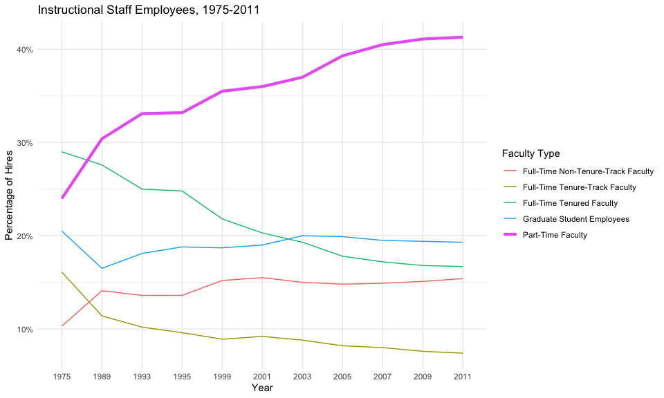
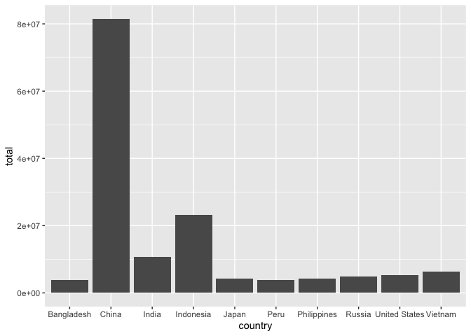
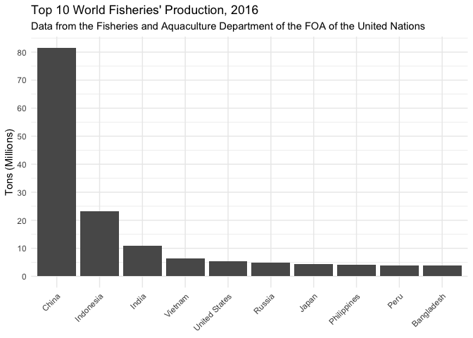
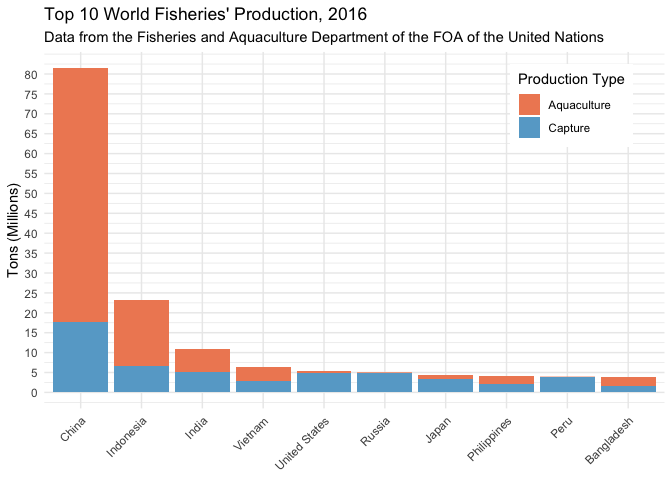

Lab 06 - Ugly charts and Simpson’s paradox
================
Noah Booker
3/29/25

# Take a Sad Plot and Make It Better

## Instructional staff employment trends

### Load packages and data

``` r
library(tidyverse) 
library(scales)
#library(dsbox)
#library(mosaicData) 
```

``` r
staff <- read_csv("data/instructional-staff.csv")
```

    ## Rows: 5 Columns: 12
    ## ── Column specification ────────────────────────────────────────────────────────
    ## Delimiter: ","
    ## chr  (1): faculty_type
    ## dbl (11): 1975, 1989, 1993, 1995, 1999, 2001, 2003, 2005, 2007, 2009, 2011
    ## 
    ## ℹ Use `spec()` to retrieve the full column specification for this data.
    ## ℹ Specify the column types or set `show_col_types = FALSE` to quiet this message.

``` r
staff_long <- staff %>%
  pivot_longer(cols = -faculty_type, names_to = "year") %>%
  mutate(value = as.numeric(value))

staff_long %>%
  ggplot(aes(x = year, y = value, color = faculty_type)) +
  geom_line()
```

    ## `geom_line()`: Each group consists of only one observation.
    ## ℹ Do you need to adjust the group aesthetic?

<!-- -->

``` r
staff_long %>%
  ggplot(aes(
    x = year,
    y = value,
    group = faculty_type,
    color = faculty_type
  )) +
  geom_line()
```

<!-- -->

### Exercise 1

Include the line plot you made above in your report and make sure the
figure width is large enough to make it legible. Also fix the title,
axis labels, and legend label.

``` r
staff_long %>%
  ggplot(aes(
    x = year,
    y = value,
    group = faculty_type,
    color = faculty_type
  )) +
  geom_line() +
  labs(title = "Instructional Staff Employees, 1975-2011",
       x = "Year", y = "Percentage of Hires",
       color = "Faculty Type") +
  scale_y_continuous(labels = label_percent(scale = 1)) +
  theme_minimal()
```

<!-- -->

### Exercise 2

Suppose the objective of this plot was to show that the proportion of
part-time faculty have gone up over time compared to other instructional
staff types. What changes would you propose making to this plot to tell
this story?

The current plot seems to tell that story pretty well. The only line
that shows a consistent positive slope over the years is Part-Time
Faculty. But perhaps I’m overlooking some changes that could make that
fact more obvious…

Solution: I had the idea of trying to make the line for Part-Time
Faculty thicker than the other lines, and asked Claude.ai for a way to
do this. Claude helped me to create the code below which adds in a
separate geom_line layer for the dataset filtered to include just
Part-Time Faculty with the linewidth set to 1.5 (instead of the default
.5). I think this plot accomplishes the goal of emphasizing the growth
in Part-Time Faculty.

``` r
staff_long %>%
  ggplot(aes(
    x = year,
    y = value,
    group = faculty_type,
    color = faculty_type
  )) +
  geom_line() +
  geom_line(data = staff_long %>% filter(faculty_type == "Part-Time Faculty"),
          aes(x = year, y = value),
          linewidth = 1.5) + 
  labs(title = "Instructional Staff Employees, 1975-2011",
       x = "Year", y = "Percentage of Hires",
       color = "Faculty Type") +
  scale_y_continuous(labels = label_percent(scale = 1)) +
  theme_minimal()
```

<!-- -->

## Fisheries

### Exercise 3

Can you help the researcher improve the data visualizations he made from
the FOA data on the fisheries production of different countries? First,
brainstorm how you would improve it. Then create the improved
visualization and document your changes/decisions with bullet points.
It’s ok if some of your improvements are aspirational, i.e. you don’t
know how to implement it, but you think it’s a good idea. Implement what
you can and leave notes identifying the aspirational improvements that
could not be made. (You don’t need to recreate their plots in order to
improve them.)

``` r
fisheries <- read_csv("data/fisheries.csv")
```

    ## Rows: 216 Columns: 4
    ## ── Column specification ────────────────────────────────────────────────────────
    ## Delimiter: ","
    ## chr (1): country
    ## dbl (3): capture, aquaculture, total
    ## 
    ## ℹ Use `spec()` to retrieve the full column specification for this data.
    ## ℹ Specify the column types or set `show_col_types = FALSE` to quiet this message.

#### Brainstorm

I have no clue what I’m looking at with the first graph——the one with
countries on the x-axis and (what I only know from your description to
be) total harvest on the y-axis (there are no anxis labels). There’s a
blue curve and a red curve that both skyrocket on the left side (which
I’m assuming shows that China has a lot of harvest since they’re the
first contry on the x-axis). But then there’s little peaks as you move
righward along the curves, but the peaks don’t seem to correspond to
where the other countries are located on the x-axis. So, I have no clue.
The other two visualizations are 3D pie charts, one showing each
country’s proportion of the total capture tonnage, and the other showing
each country’s proportion of the total aquaculture tonnage. I learned
from Module 5 that bar charts are bad and 3D is bad. The description in
the lab says that the visualization excludes countries with less than
100,000 tons. This is probably a good call since there are 216 countries
in the dataset. It seems to me like a reasonable primary goal with
creating a visualization for this data is to be able to compare
countries’ total tonnage of fish. Second, in visualizing tonnage of fish
by country, we might also want to display how much of each country’s
total tonnage came from capture or aquaculture. Third, ignoring total
tonnage, we may be interested in comparing each country by the
proportion of their fish which came from capture or aquaculture.

#### Improved Visualization

• Let’s first get an idea of how many countries we can usefully compare.
The lab description says that the visualization excludes countries with
less than 100,000 tons. Let’s see how many countries that leaves us
with.

``` r
fisheries %>% 
  filter(total >= 100000)
```

    ## # A tibble: 82 × 4
    ##    country    capture aquaculture   total
    ##    <chr>        <dbl>       <dbl>   <dbl>
    ##  1 Angola      486490         655  487145
    ##  2 Argentina   755226        3673  758899
    ##  3 Australia   174629       96847  271476
    ##  4 Bangladesh 1674770     2203554 3878324
    ##  5 Brazil      705000      581230 1286230
    ##  6 Cambodia    629950      172500  802450
    ##  7 Cameroon    233190        2315  235505
    ##  8 Canada      874727      200765 1075492
    ##  9 Chad        110000          94  110094
    ## 10 Chile      1829238     1050117 2879355
    ## # ℹ 72 more rows

• Making the cutoff at 100,000 tons still leaves us with a dataframe
with 82 countries. That seems like too many to usefully compare. I think
it seems more reasonable to compare the top ten.

``` r
fisheries_top10 <- fisheries %>% 
  arrange(desc(total)) %>% 
  slice(1:10) #Thanks to Claude for suggesting the slice( ) function.
```

• A barplot seems to me like the most appropriate way to compare
countries on their fishery production (much better than a pie chart or
whatever that other graph is).

``` r
fisheries_top10 %>% 
  ggplot(aes(x = country, y = total)) +
  geom_col()
```

<!-- -->

• Order matters: order countries on x-axis in order of fish production.

``` r
fisheries_top10 <- fisheries_top10 %>% 
  mutate(
    country = fct_relevel(
      country,
      "China", "Indonesia", "India", "Vietnam", "United States", 
      "Russia", "Japan", "Philippines", "Peru", "Bangladesh"))
```

• Use meaningful and nonredundant labels: Improve y-axis label, remove
x-axis label, add title and subtitle.

• Make country labels angled for easier reading (I like this option
better than coord_flip).

• Fix y-axis value labels to be regular numbers, in increments of 10
million.

``` r
fisheries_top10 %>% 
  ggplot(aes(x = country, y = total)) +
  geom_col() +
  labs(x = NULL, y = "Tons (Millions)", title = "Top 10 World Fisheries' Production, 2016",
       subtitle = "Data from the Fisheries and Aquaculture Department of the FOA of the United Nations") +
  theme_minimal() +
  #I recycled this code for angling the x-axis value labels from the Brexit activity. (Claude helped create it.)
  theme(
    axis.text.x = element_text(angle = 45, hjust = 1)) +
  #Claude helped with the code below to get the y-axis value labels how I wanted them.
  scale_y_continuous(
    breaks = seq(0, max(fisheries_top10$total), by = 10000000),
    labels = function(x) x/1000000
  )
```

<!-- -->

• Show each country’s total’s composition of captured vs. farmed fish.

``` r
# Reshape the data from wide to long format
fisheries_top10_long <- fisheries_top10 %>%
  pivot_longer(cols = c(capture, aquaculture), 
               names_to = "production_type",
               values_to = "value")

# Create the stacked bar chart
fisheries_top10_long %>%
  ggplot(aes(x = country, y = value, fill = production_type)) +
  geom_col() +
  labs(x = NULL, 
       y = "Tons (Millions)", 
       title = "Top 10 World Fisheries' Production, 2016",
       subtitle = "Data from the Fisheries and Aquaculture Department of the FOA of the United Nations",
       fill = "Production Type") +
  theme_minimal() +
  #Thanks Claude for helping to adjust the legend position.
  theme(
  axis.text.x = element_text(angle = 45, hjust = 1),
  legend.position = "inside",
  legend.position.inside = c(0.85, 0.85),
  legend.background = element_rect(fill = "white", color = NA, linewidth = 0.5),
  legend.margin = margin(6, 6, 6, 6)
) +
  scale_y_continuous(
    breaks = seq(0, max(fisheries_top10$total), by = 5000000),
    labels = function(x) x/1000000
  ) + #Used the colors from the Brexit activity.
  scale_fill_manual(values = c(
    "aquaculture" = "#ef8a62",
    "capture" = "#67a9cf"),
labels = c(
  "aquaculture" = "Aquaculture",
  "capture" = "Capture"
))
```

<!-- -->

#### Other things I would do with more time

If I had more time to spend on this lab I might do some other things.

• Compare the top ten countries on their proportion of fishery
production that comes from aquaculture or capture while ignoring total
producton (similar to how we compared to proportion of opinions by
region in the Brexit data, ignoring differences in regional sample
sizes).

• Create a variable that represents each countries proportion of the
overall total fishery production and compare the top 10 countries. This
would tell us what proportion of the world’s total fishery production
China, for example, accounts for. The pie charts shown in the lab module
sort of do this (separately for capture and aquaculture), but a bar
graph would make it easier to quantify.
